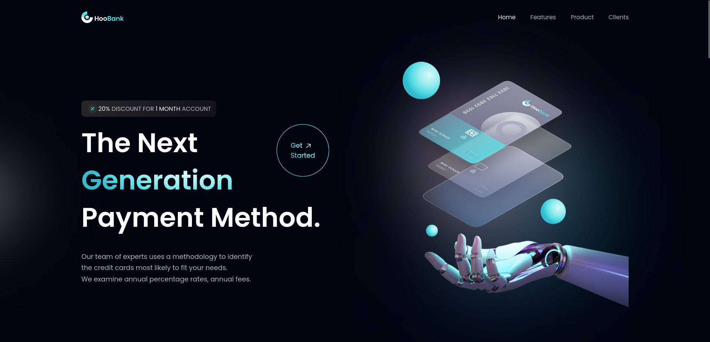

### HooBank

**HooBank** is a landing page application for a SaaS website, built using **React** and **Tailwind CSS**. The project serves as a practice exercise in front-end development, focusing on implementing a Figma design and enhancing skills with modern web development tools. It provides an opportunity to work with a real-world layout, improving proficiency in responsive design and UI development.

## Features

Responsive layout using Tailwind CSS
Modern design based on a Figma mockup
Built with React for component-based development

## Figma Design

[Figma Design: HooBank](https://www.figma.com/design/bUGIPys15E78w9bs1l4tgS/HooBank?t=o5XMj7Y5VVuqBK1W-0)
